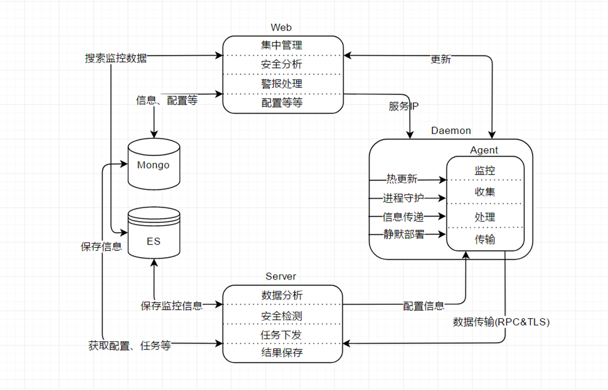
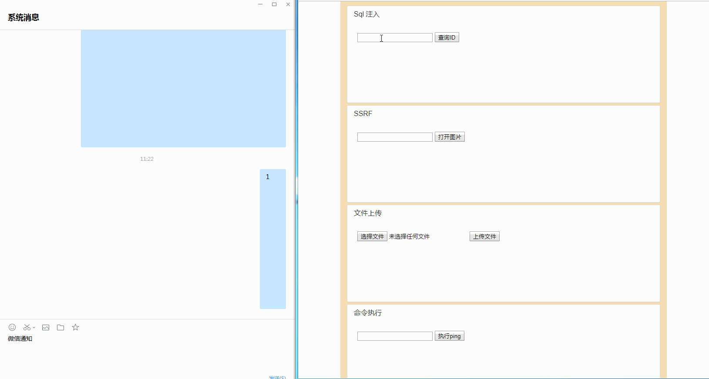

# 驭龙 HIDS 


[](https://github.com/ysrc/yulong-hids/blob/master/LICENSE)
[](https://www.golang.org/) [](https://www.mongodb.com/download-center?jmp=nav) [](https://www.elastic.co/downloads/elasticsearch)


**驭龙HIDS**是一款由 YSRC 开源的入侵检测系统，由 `Agent`， `Daemon`， `Server` 和 `Web` 四个部分组成，集异常检测、监控管理为一体，拥有异常行为发现、快速阻断、高级分析等功能，可从多个维度行为信息中发现入侵行为。

**Agent**为采集者角色，收集服务器信息、开机启动项、计划任务、监听端口、服务、登录日志、用户列表，实时监控文件操作行为、网络连接、执行命令，初步筛选整理后通过RPC协议传输到Server节点。

**Daemon**为守护服务进程，为Agent提供进程守护、静默环境部署作用，其任务执行功能通过接收服务端的指令实现Agent热更新、阻断功能和自定义命令执行等，任务传输过程使用RSA进行加密。

**Server**为整套系统的大脑，支持横向扩展分布式部署，解析用户定义的规则（已内置部分基础规则）对从各Agent接收到的信息和行为进行分析检测和保存，可从各个维度的信息中发现webshell写入行为、异常登录行为、异常网络连接行为、异常命令调用行为等，从而实现对入侵行为实时预警。

## 文档

* [部署文档](./docs/install.md)
* [使用帮助](./docs/help.md)
* [规则编写](./docs/rule.md)
* [编译指南](./docs/build.md)

## 功能特点

- 实时监控、秒级响应
- 全局首次出现概念，可发现未知威胁
- 支持自定义规则，高扩展性
- 高级分析功能，可溯源
- 全局快速阻断（进程、文件、网络）
- 威胁情报查询（可自定义接口）


> 相比其他同类应用，维护使用此系统需要有一定的安全判断分析能力。


## 整体架构图



## 测试效果图




## TODO
- 应用信息识别（例如apache、nginx、mysql），漏洞库
- 区分通讯模式（主动、被动）
- 使用消息队列代替RPC
- 基线核查
- 幻影蜜罐（基于真实环境虚化出来的动态蜜罐，无需独立部署）
- 支持多场景（办公环境、线上环境、Docker）
- 机器学习判断可疑行为

## 源码结构
```
├─agent // Agent工程
│  ├─client // RPC client 传输模块
│  ├─common
│  ├─collect // 信息收集（开机启动项、计划任务、监听端口、服务、登录日志、用户列表）
│  └─monitor // 行为监控（文件操作、网络连接、执行命令）
├─bin
│  ├─linux-64 // Linux 64位的依赖包
│  ├─win-32 // Windows 32位的依赖包
│  └─win-64 // Windows 64位的依赖包
├─daemon // Daemon工程
│  ├─common
│  ├─install // 安装Agent和相关依赖
│  └─task // 任务接收
├─docs // 说明文档
├─driver // Windows 命令监控驱动
├─server // Server节点工程
│  ├─action // Server基本功能
│  ├─models // 数据库相关
│  └─safecheck // 安全检测模块（黑白名单，规则解析引擎）
├─syscall_hook # 监控执行命令的Linux内核代码
│  └─test_bench // 方便调试的
└─web // Web控制台项目
    ├─conf // 配置文件
    ├─controllers
    ├─httpscert // https证书和RSA私钥，内置的会在向导过程中自动替换掉
    ├─models
    ├─routers
    ├─settings
    ├─static // 静态文件（css，js）
    ├─upload_files // agent、daemon、依赖包文件
    ├─utils
    └─views // 前端模板
```

## 参与者及致谢

致谢列表：[Contributors List](./contributors.md)

## 关于

本项目经过 YSRC 测试和部署，但由于企业网络架构与部署环境之间的差异，我们无法保证本项目在贵司环境中的稳定性及有效性。
使用前请先自行测试和改动，对应用本系统可能导致的损失 YSRC/同程安全应急响应中心/同程网络科技股份有限公司概不负责。

本项目现已放出所有源码，但是未发布 release， 测试和使用请等待正式的 release 发布。
目前正在小范围的部署测试，已有多家公司及个人参与测试。
想参与测试的同学，请扫描下方二维码关注YSRC公众号，回复 驭龙 ，会有人拉你进驭龙的微信讨论群。


