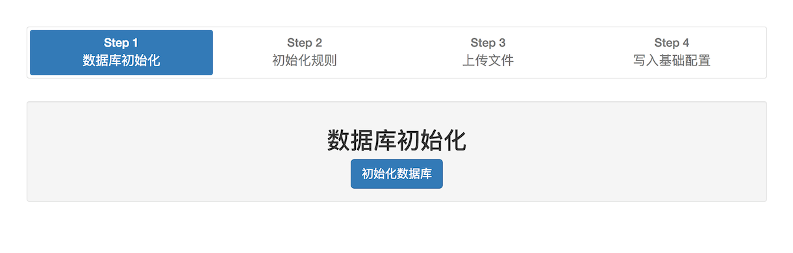
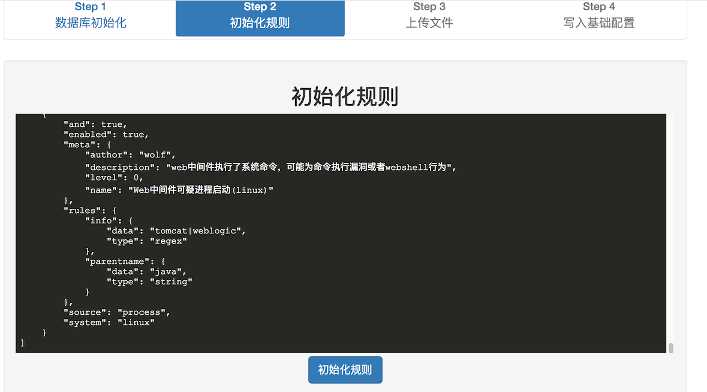
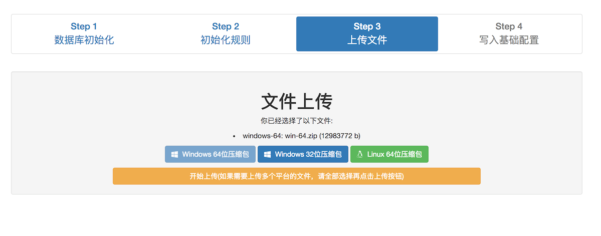
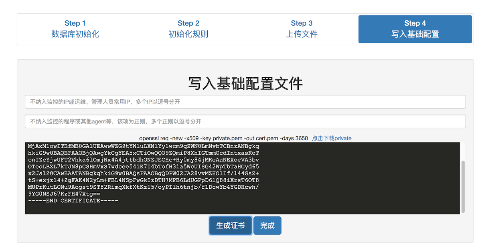

# Web安装向导指南

## step.1

点击初始化，初始化数据库。

## step.2

初始化规则, 规则可以自己编写，也可以使用默认规则，默认规则可在 release 包内的 rules.json 找到，也可以复制 [rules.json](https://github.com/ysrc/yulong-hids/blob/master/rules.json) 里的内容。

## step.3

第三步上传文件包，文件包内包含着 agent, daemon, data 三个文件， 可从 release 里面找到对应的压缩包上传。最好三个系统版本全部上传，不然后续无法增加新的系统版本。

该压缩包可以在对应的系统下，使用 /build/build.py 生成。

## step.4

请注意查看编辑框内的提示信息，填写相应内容。

点击生成“生成证书”按钮，如果 web 是运行在linux下的话，应该可以直接生成证书，如果不是linux的话，可下载私钥文件并使用提示命令生成证书，再将证书内容放置于编辑框内。
