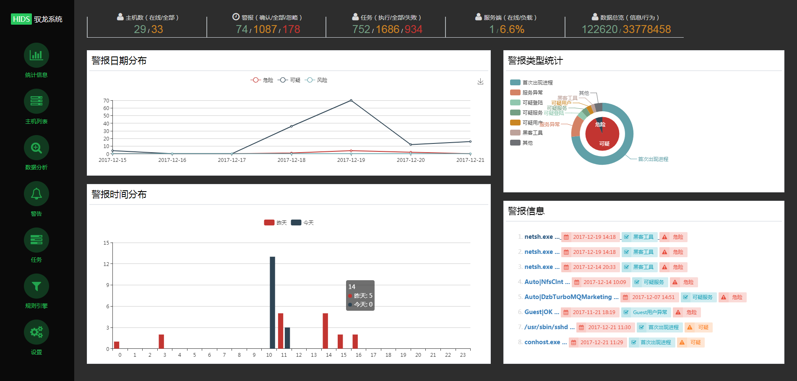
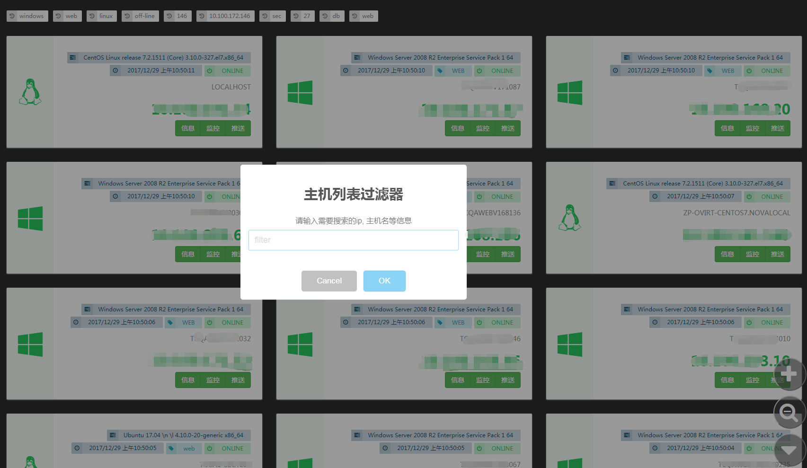
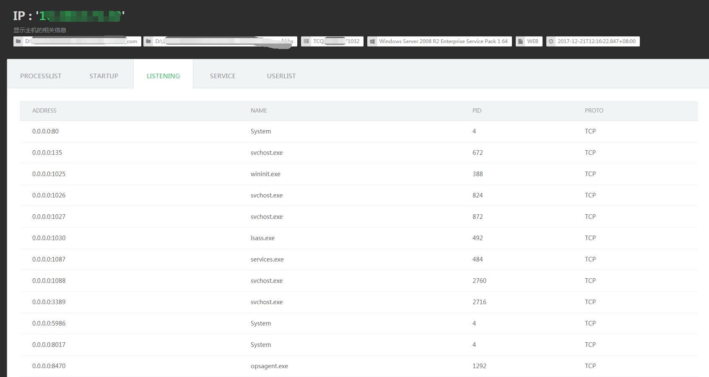
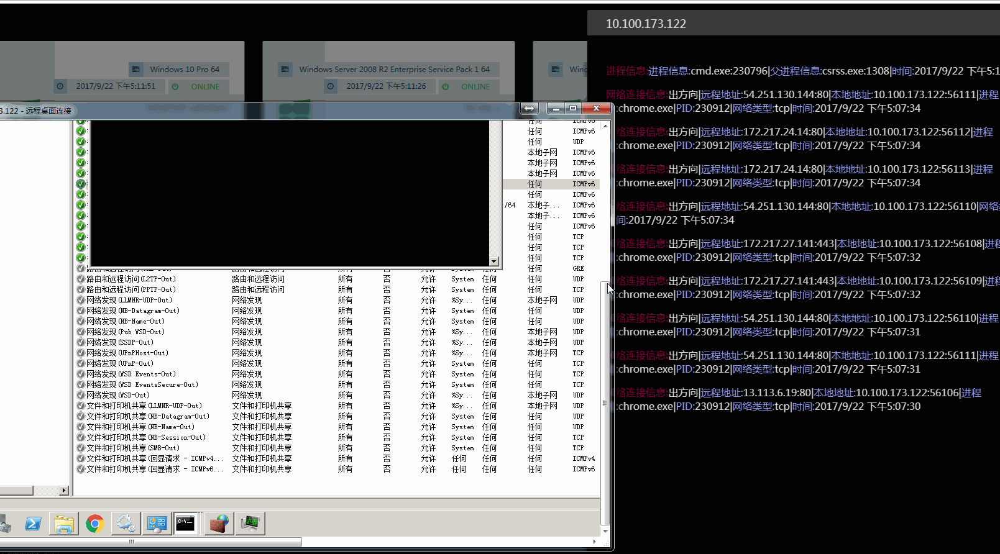
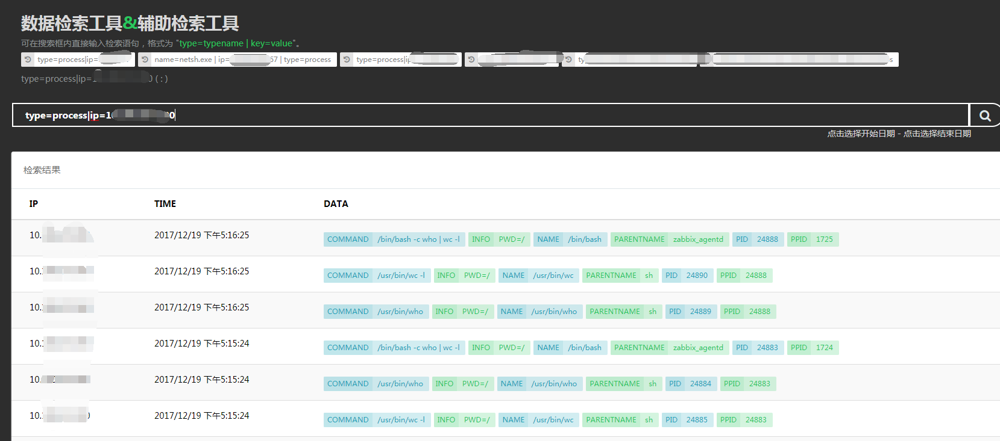
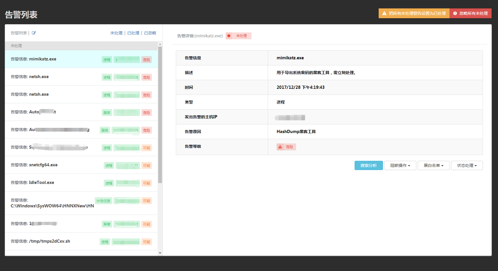
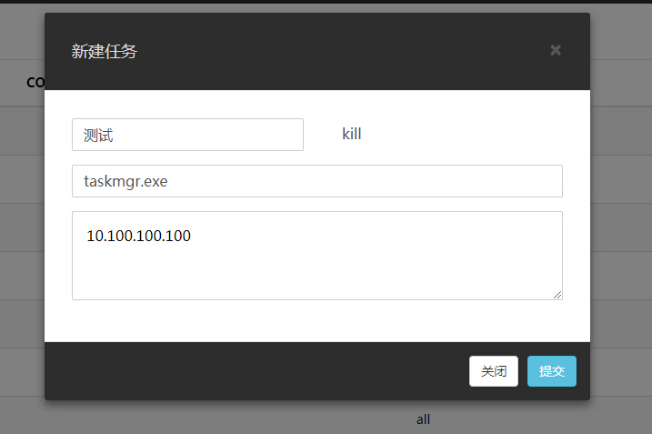
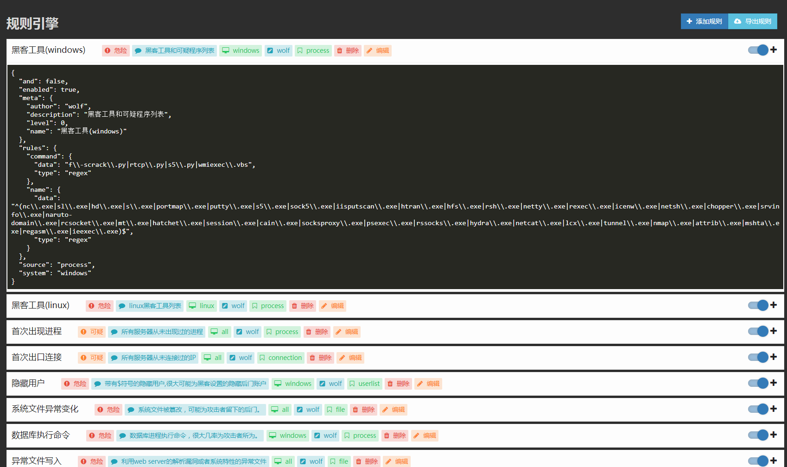

# 使用帮助
----------
## 功能介绍

控制台拥有以下功能：统计查看、主机查看管理、数据分析、告警处理、任务推送、规则配置、系统设置。

### 统计

展示驭龙HIDS的各项数据信息，包括：警报分布、警报信息TOP、警报类型统计、主机数、任务、数据总览等等。
具体如下图所示：

### 主机列表

展示当前已部署agent的主机列表，可通过搜索功能和快速标签进行筛选并进行实时监控主机行为和查看关键信息。

具体如下图所示：

筛选

主机信息查看

实时监控

### 数据分析

通过此功能可搜索分析查看所有从agent收集到的信息，包括以下：用户列表、服务列表、开机启动项、计划任务、监听端口、登录日志、文件行为、网络连接、执行命令以及统计信息。可对整个企业主机行为信息进行人工分析和入侵行为进行溯源。

搜索语法为：`type:typename | key:value` ,可通过Tab提醒功能进行查看补全，具体各类型结构可查看规则编写文档。

> 备注: 部分搜索条件返回的结果会根据ES上的分词索引的不同而产生差异,exist_count 所产生的搜索会有比较大的时间成本请耐心等待。

例子：

	// 搜索ip为172.16.22.101的系统登录日志。
	type:loginlog|ip:172.16.22.101

	// 搜索ip为172.16.168.47 进程名为taskkill.exe 的执行事件信息。
	type:process|ip:172.16.168.47|name:taskkill.exe

	// 搜索所有机器的用户，条件为用户名Guest，状态为启用。
	type:userlist|name:Guest|status:OK
	
	// 搜索ip为172.16.33.33 路径为d:\wwwroot\upload\test.aspx的文件操作行为
	type:file|ip:172.16.33.33|path.keyword:d:\wwwroot\upload\test.aspx

	// 搜索出现次数为3的进程信息。
	type:process|count:3

	// 搜索出现次数为小于3的进程信息。
	type:process|count:<3

	// 搜索登录超过10台的服务器的IP和相关服务器信息。
	type:loginlog|exist_count:>=10

### 警告

所有触发规则的记录都会在此显示，通过此面板进行处置，网络连接、进程和文件可在此面板进行全网阻断。

具体如下图所示：

### 任务

可通过此功能对指定主机发送任务指令，包括以下：

- kill: 结束进程(传入进程名)
- uninstall: 卸载自身
- update: Agent更新
- delete: 文件删除(传入文件路径)
- exec: 自定义命令 (发布的release不支持这个功能，如需这个功能，请去掉注释，自行编译agent)
- reload: 重启Agent
- quit: 结束自身

任务推送范围可为以下格式：
	
	// 指定IP
	172.16.11.111

	// IP范围
	192.168.1.1-192.168.1.100

	// 标签
	windows，linux
	
	// 所有主机
	all

### 规则引擎

定义告警规则，可通过此面板进行添加、修改、删除、启用、关闭、导出，具体格式可查看规则编写文档。

具体如下图所示：

### 设置

系统配置中心，可根据自身实际情况进行设置。

各配置项说明如下：
- **客户端** // Agent配置
  - 间隔 // 收集型信息回传间隔
  - 内网连接 // 是否记录内网网络连接信息
  - 模式 // 模式（规划中）
  - 监控目录 // 文件操作监控目录，%web%为自动识别的web目录，\*结尾为迭代监控（例如/tmp/\*）
  - 记录UDP // 是否记录UDP连接信息
- **服务端** // Server配置
  - 证书 // 证书
  - 观察模式 // 开启观察模式后所有的警报都只做记录统计方便判断是否为误报，在关闭时可进行汇总处理。（部署后默认为观察模式）
  - 私钥 // 任务指令加密传输RSA私钥（Server用）
  - 公钥 // 任务指令加密传输RSA公钥（Daemon用）
- **威胁情报** // 威胁情报接口配置
  - IP检测接口 // IP威胁情报接口，格式为：http://x.x.x.x/api/check_ip/?ip={$ip}，{$ip}为IP的占位符
  - 文件检测接口 // 文件威胁情报接口，格式为：http://x.x.x.x/api/check_file/?hash={$hash}，{$hash}为文件md5值的占位符
  - 匹配正则 // 接口返回结果判断正则，如果匹配会产生警报信息
  - 开启 // 开关
- **黑名单** // 黑名单列表
  - 文件 // 文件行为，可文件md5或文件路径的正则(自动识别)
  - IP // IP地址，不包含端口
  - 进程 // 进程名称或参数的正则
  - 其他 // 其他类型信息的正则（自动识别对应的关键字段）
- **白名单** // 白名单
  - 文件 // 文件行为，可文件md5或文件路径的正则(自动识别)
  - IP // IP地址，不包含端口
  - 进程 // 进程名称或参数的正则
  - 其他 // 其他类型信息的正则（自动识别对应的关键字段）
- **过滤** // Agent过滤条件（不传回Server记录，直接抛弃）
  - 文件 // 文件行为，可文件md5或文件路径的正则(自动识别)
  - IP // IP地址，不包含端口
  - 进程 // 进程名称或参数的正则
- **通知** // 威胁情报
  - 接口 // 通知接口（例如短信、微信、邮件），格式为：http://x.x.x.x/sendmsg/?text={$info}，{$info}为消息通知占位符
  - 仅危险警告 // 仅对危险等级的告警进行通知
  - 开启 // 开关
- **Agent更新** // 更新Agent
